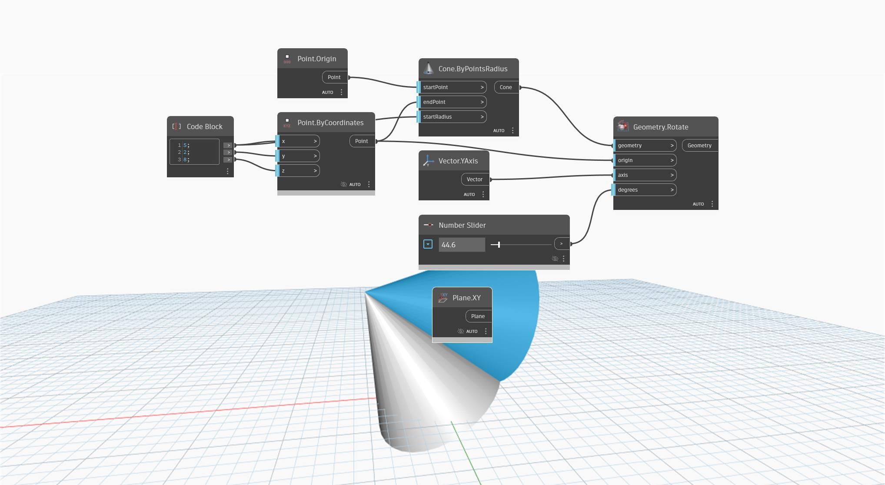

<!--- Autodesk.DesignScript.Geometry.Geometry.Rotate(geometry, origin, axis, degrees) --->
<!--- Z62AE2MAWASIXXZ7HW3OJ37OGY24A3M2KOTCHO7DR52NRIL2JQCA --->
## Informacje szczegółowe
Węzeł `Geometry.Rotate (origin, axis, degrees)` obraca geometrię wejściową wokół płaszczyzny bazowej o zdefiniowany kąt w stopniach (degrees).

W poniższym przykładzie stożek zostaje obrócony wokół płaszczyzny XY za pomocą suwaka Number Slider.

___
## Plik przykładowy

