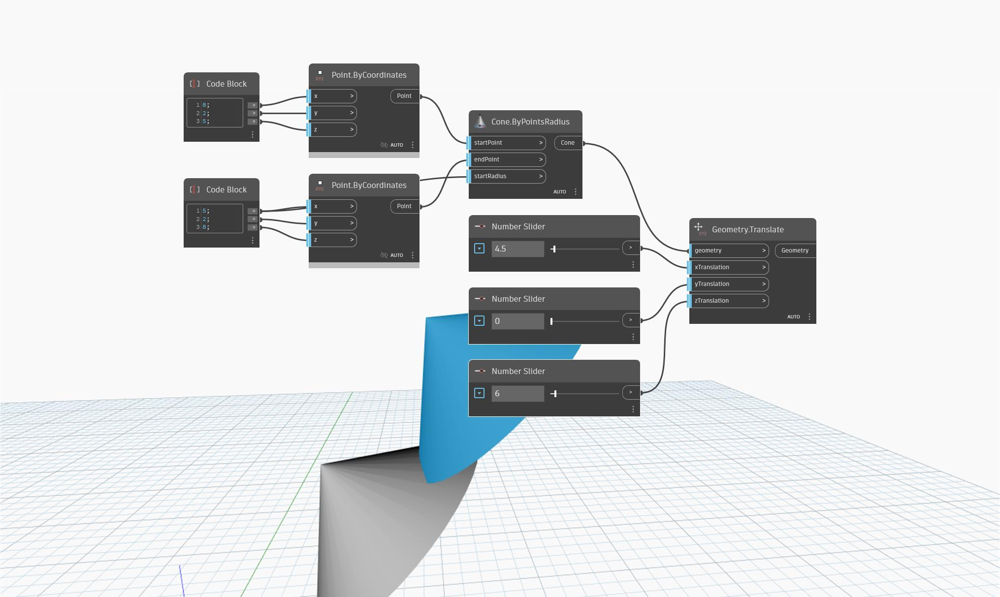

<!--- Autodesk.DesignScript.Geometry.Geometry.Translate(geometry, xtranslation, ytranslation, ztranslation) --->
<!--- Z7RCGSZ7PG327WNJNF5LAVZMVCYSSBNPUFE666HLMLY4QCDT4TDQ --->
## Informacje szczegółowe
Węzeł `Geometry.Translate (xTranslation, yTranslation, zTranslation)` przesuwa geometrię wejściową zgodnie z podanymi przemieszczeniami wzdłuż osi X, Y i Z.

W poniższym przykładzie stożek jest przesuwany w kierunkach osi X i Z o odległość sterowaną za pomocą suwaków Number Slider.
___
## Plik przykładowy

