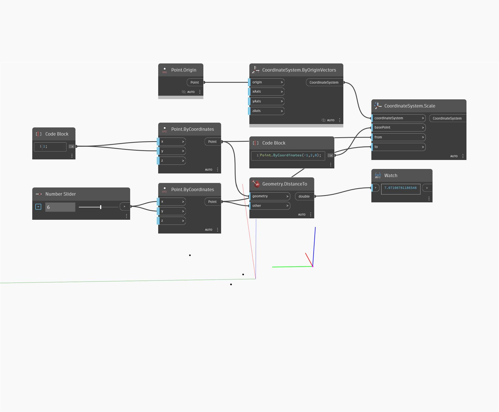

<!--- Autodesk.DesignScript.Geometry.CoordinateSystem.Scale(basePoint, from, to) --->
<!--- ZQ5G3XLBM6AP62MCXAVZY7HD4ZQ7VGZPQJXEUD75YACYNU2RIDHQ --->
## Informacje szczegółowe

___
## Plik przykładowy

