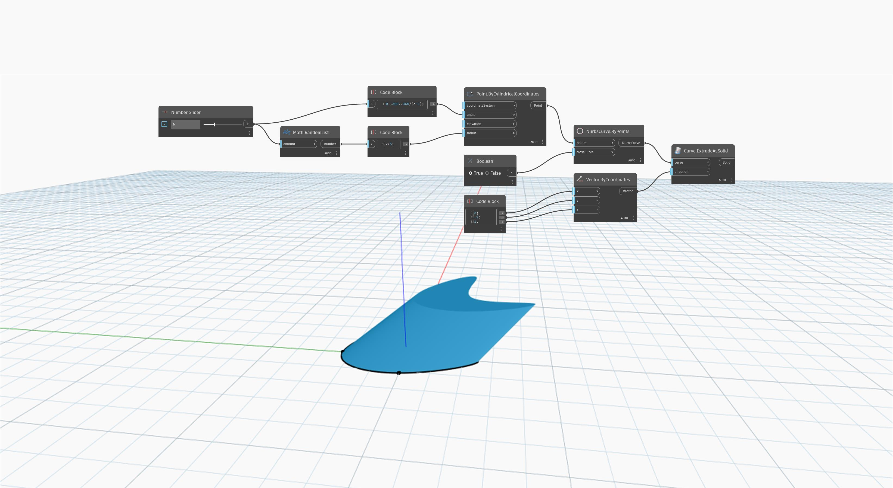

<!--- Autodesk.DesignScript.Geometry.Curve.ExtrudeAsSolid(curve, direction) --->
<!--- 32PIZL43K2RTMXYNALUOXTTTTLRY2XQHUK22D2A7KI7NAA5JTXBA --->
## Em profundidade
`Curve.ExtrudeAsSolid (curve, direction)` efetua a extrusão de uma curva plana fechada de entrada usando um vetor de entrada para determinar a direção da extrusão. O comprimento do vetor é usado para a distância de extrusão. Esse nó limita as extremidades da extrusão para criar um sólido.

No exemplo abaixo, primeiro criamos uma NurbsCurve usando um nó `NurbsCurve.ByPoints`, com um conjunto de pontos gerados aleatoriamente como entrada. Um bloco de código é usado para especificar os componentes X, Y e Z de um nó `Vector.ByCoordinates`. Esse vetor é usado como entrada de direção em um nó `Curve.ExtrudeAsSolid`.
___
## Arquivo de exemplo

