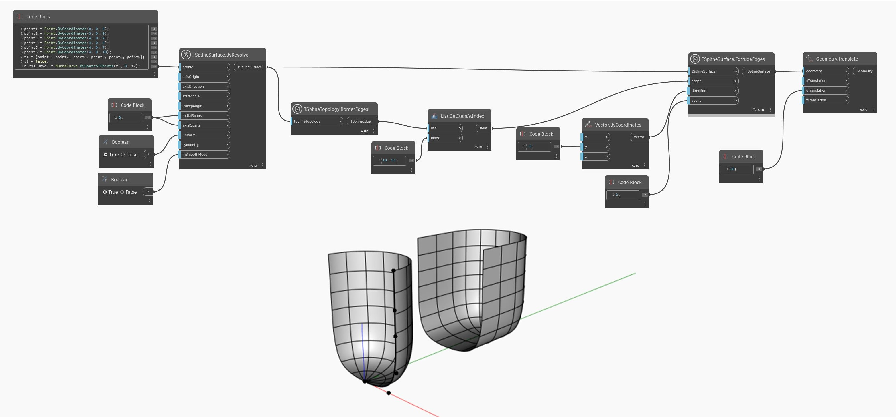

## Em profundidade
No exemplo abaixo, um conjunto de arestas de borda de uma superfície da T-Spline é selecionado e usado como entrada para o nó `TSplineSurface.ExtrudeEdges`. O resultado é convertido na lateral para oferecer uma melhor visualização.
___
## Arquivo de exemplo

