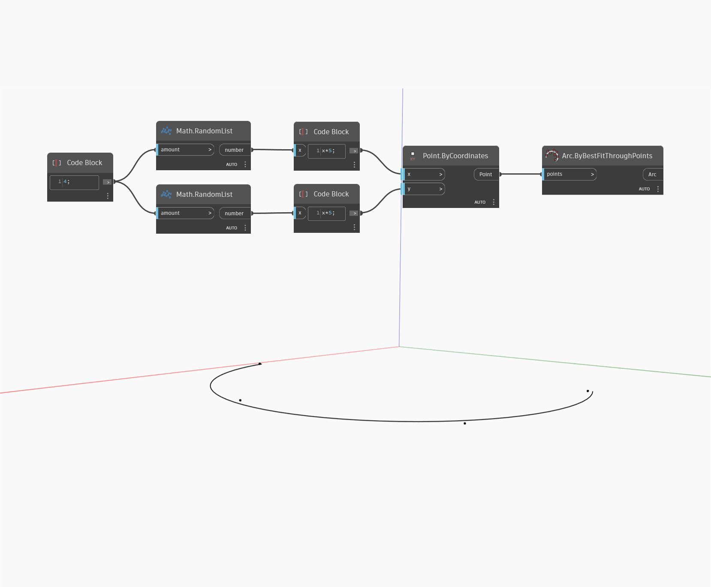

## Em profundidade
`Arc.ByBestFitThroughPoints` desenha um arco que melhor representa três ou mais pontos.

No exemplo abaixo, criamos um arco que se aproxima de uma lista de pontos aleatórios que variam de 0 a 5 nas direções X e Y.

___
## Arquivo de exemplo

