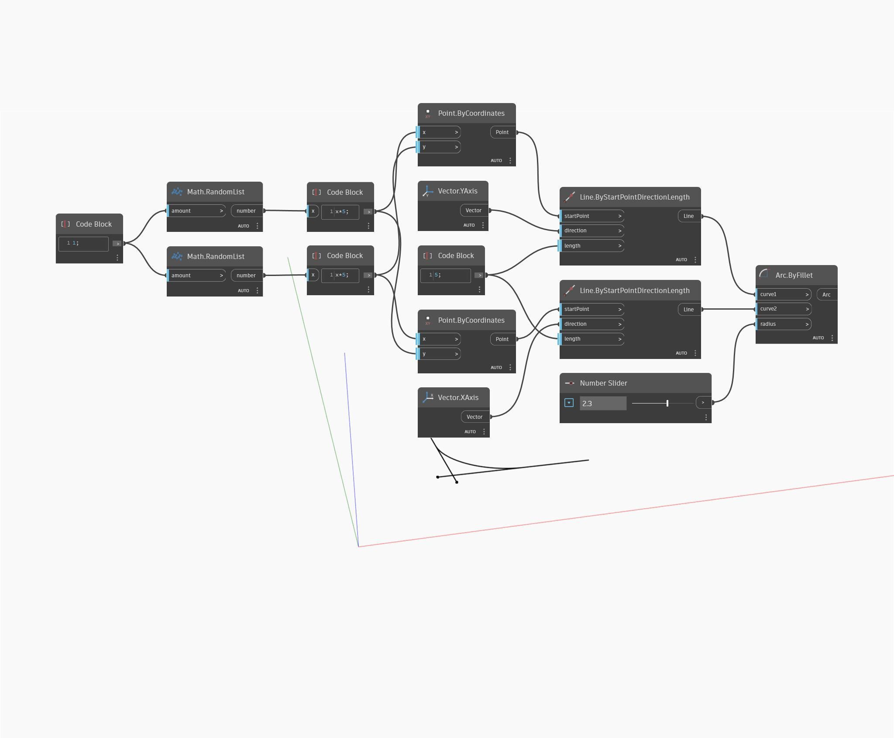

## Em profundidade
Arc ByFillet desenha uma parte de um círculo tangencial ao longo de duas curvas de entrada. Neste exemplo, duas linhas de interseção são desenhadas e, em seguida, arredondadas em um raio controlado.
___
## Arquivo de exemplo

