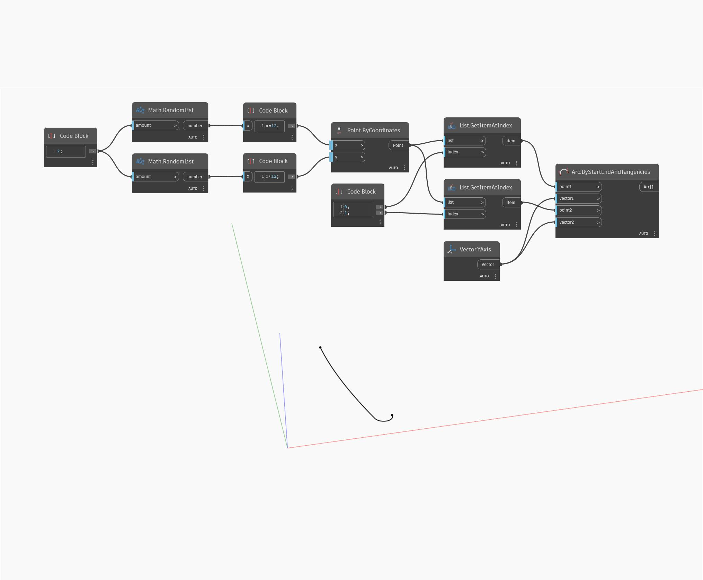

## Em profundidade
Arc ByStartEndAndTangencies Action cria um arco composto usando dois pontos de entrada e seus vetores correspondentes. Neste exemplo, dois pontos são conectados por um arco composto que é sempre tangente ao eixo Y em seus pontos inicial e final.
___
## Arquivo de exemplo

