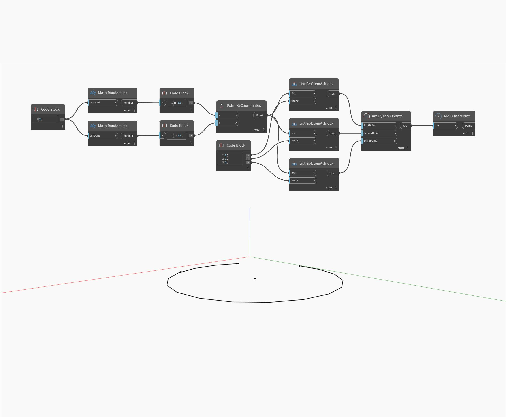

## Em profundidade
`Arc.CenterPoint` retorna um ponto no centro de um arco, o mesmo ponto que o centro do círculo correspondente.

No exemplo abaixo, criamos um arco com base em três pontos gerados aleatoriamente e, em seguida, retornamos seu ponto central com um nó `Arc.CenterPoint`.

___
## Arquivo de exemplo

