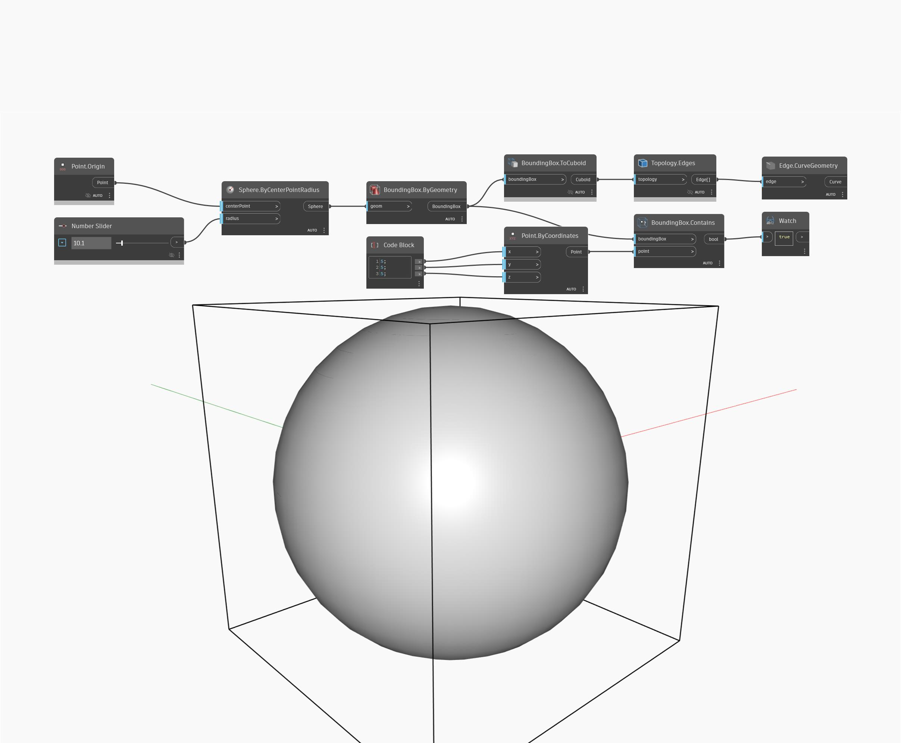

## Em profundidade
Bounding Box Contains testa se um ponto especificado está dentro de uma caixa delimitadora. Como o ponto neste exemplo está em (5,5,5) e o raio da esfera de origem é maior que 5, o nó Contains retornará True.
___
## Arquivo de exemplo

