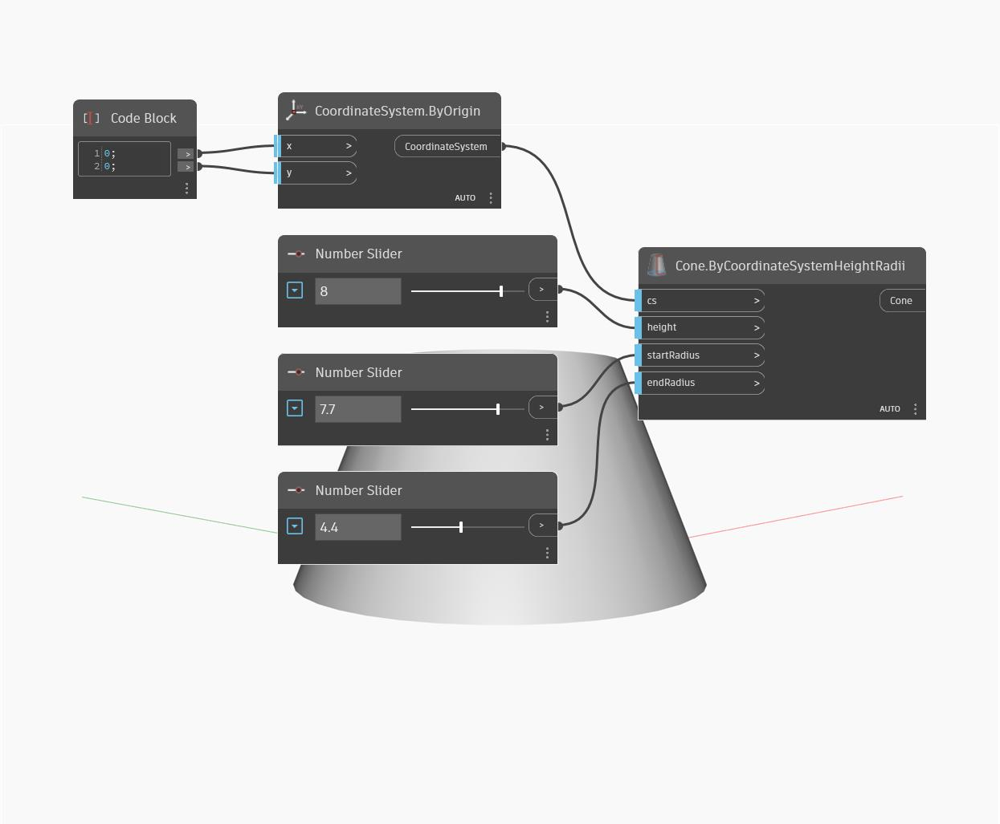

## Em profundidade
Cone ByCoordinateSystemHeightRadii cria uma geometria de cone truncada com base em dois raios, na origem universal e em um valor de altura. Este exemplo mostra um cone dinâmico em torno da origem universal, construído com três controles deslizantes de número.
___
## Arquivo de exemplo

