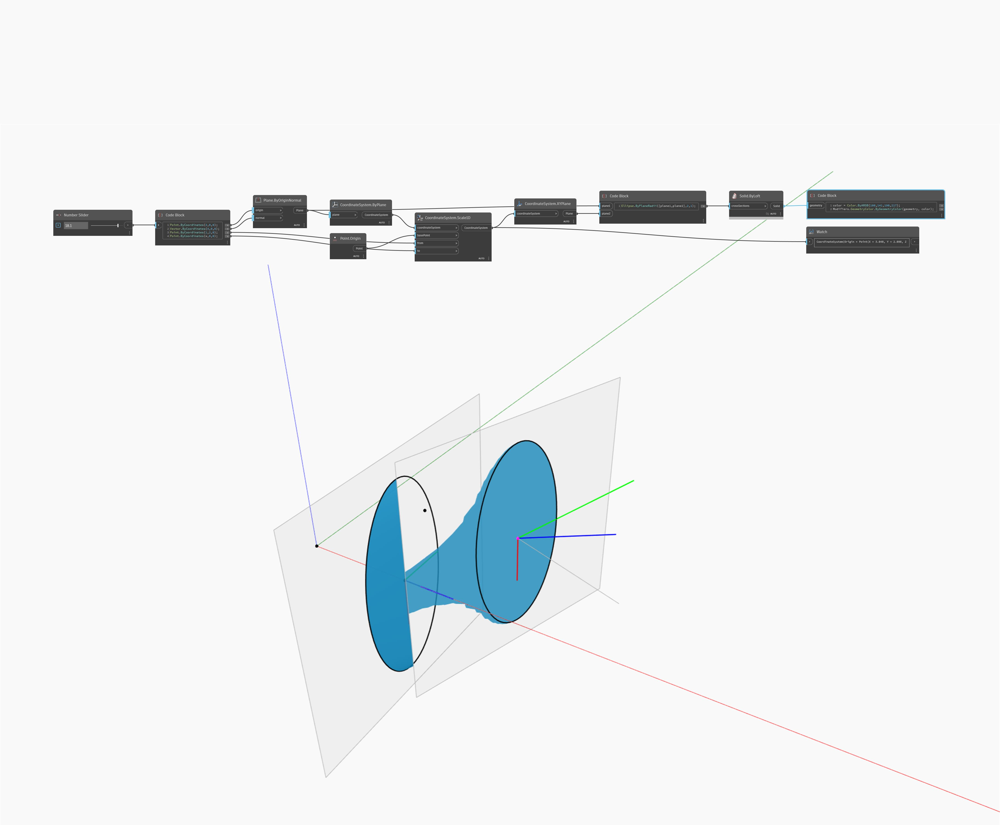

## Em profundidade
Geometry Scale1D dimensiona uma geometria em uma direção desde um ponto base e dois pontos de referência. No arquivo de exemplo, um cone é dimensionado desde o ponto final para seu centroide em relação ao ponto inicial do cone. As arestas do cone originais são desenhadas como uma referência visual.
___
## Arquivo de exemplo

