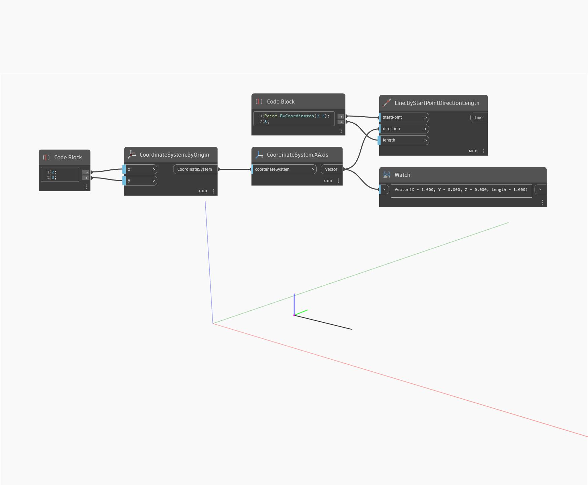

## Em profundidade
XAxis retornará um vetor que representa o eixo X do WorldCoordinateSystem. No exemplo abaixo, o vetor retornado é usado para criar uma linha que segue o eixo X do WCS.
___
## Arquivo de exemplo

