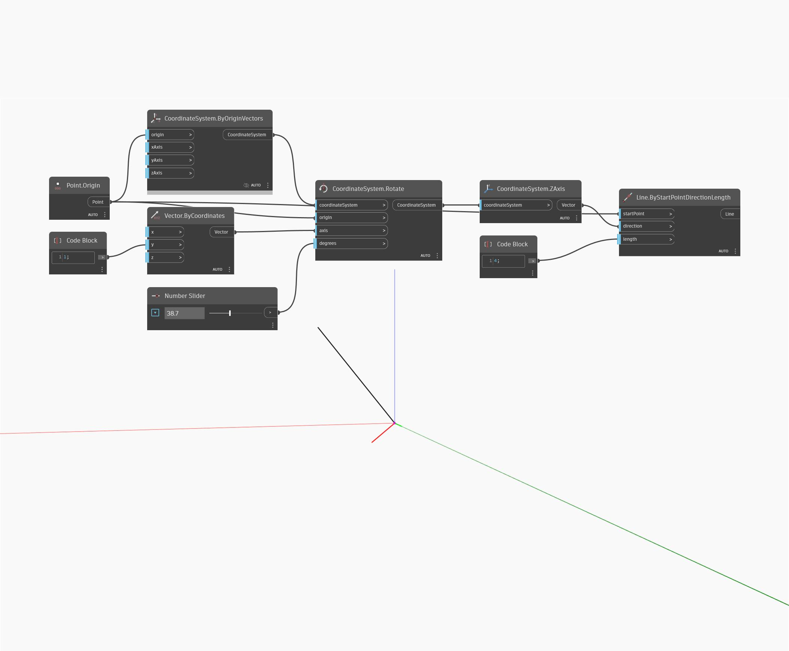

## Em profundidade
ZAxis retornará um vetor que representa o eixo Z do WorldCoordinateSystem. No exemplo abaixo, o vetor retornado é usado para criar uma linha que segue o eixo Z do WCS.
___
## Arquivo de exemplo

