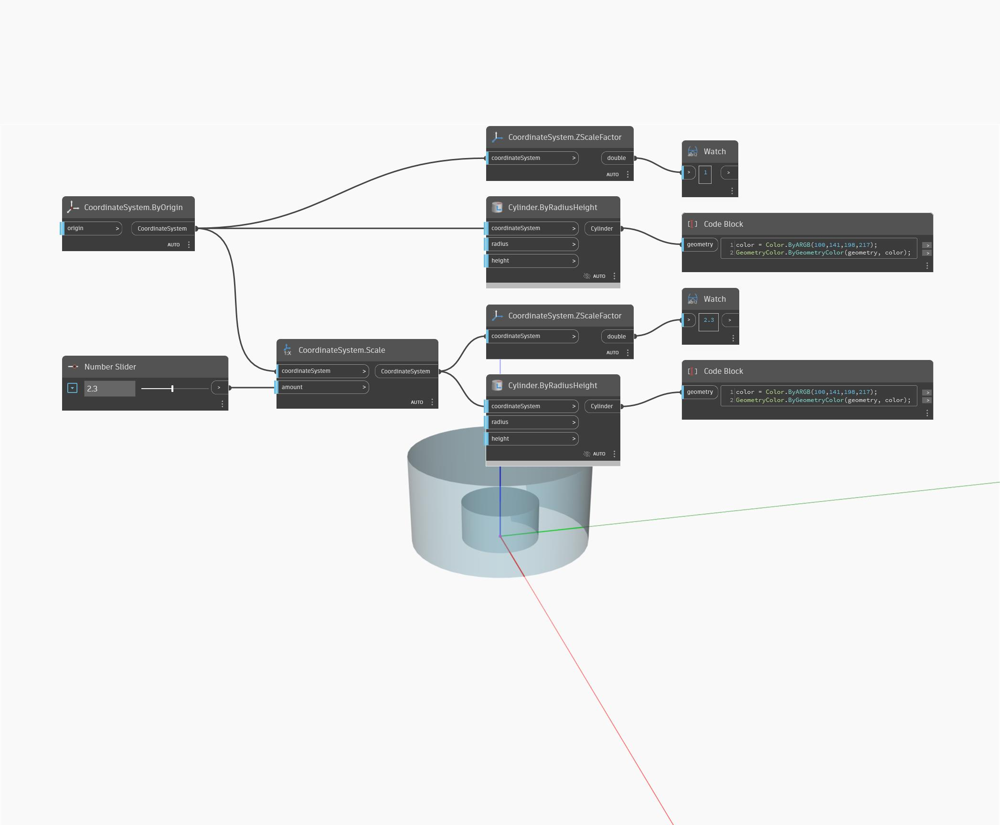

## Em profundidade
ZScaleFactor retornará um duplo representando o fator de escala ao longo do eixo Z. No exemplo abaixo, um cilindro é escalado por 2,3, retornando um fator de escala Z de 2,3.
___
## Arquivo de exemplo

