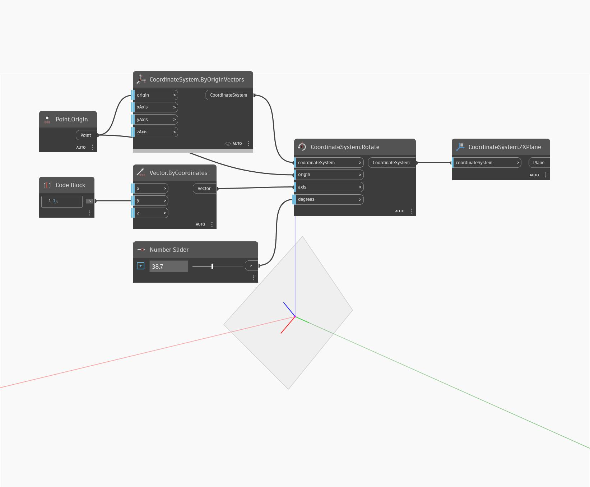

## Em profundidade
ZXPlane retornará um plano nos eixos Z e X de um CoordinateSystem. No exemplo abaixo, um plano é colocado nos eixos ZX de um CoordinateSystem rotacionado.
___
## Arquivo de exemplo

