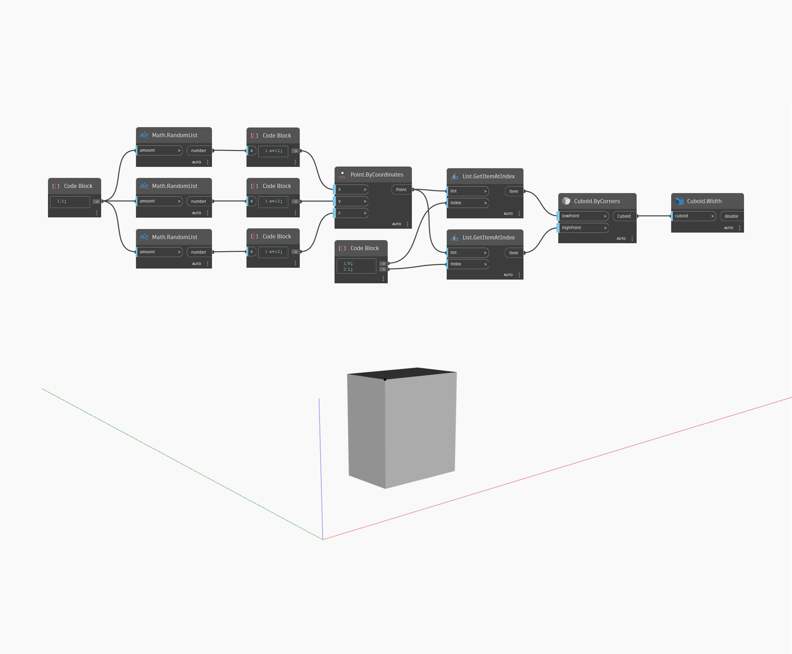

## Em profundidade
`Cuboid.Width` retorna a largura do cuboide de entrada.

No exemplo abaixo, geramos um cuboide pelos cantos e, em seguida, usamos um nó `Cuboid.Width` para encontrar sua largura. Observação: Se o cuboide tiver sido transformado em um sistema de coordenadas diferente com um fator de escala, isso retornará a dimensão original do cuboide, não as dimensões do espaço universal.

___
## Arquivo de exemplo

