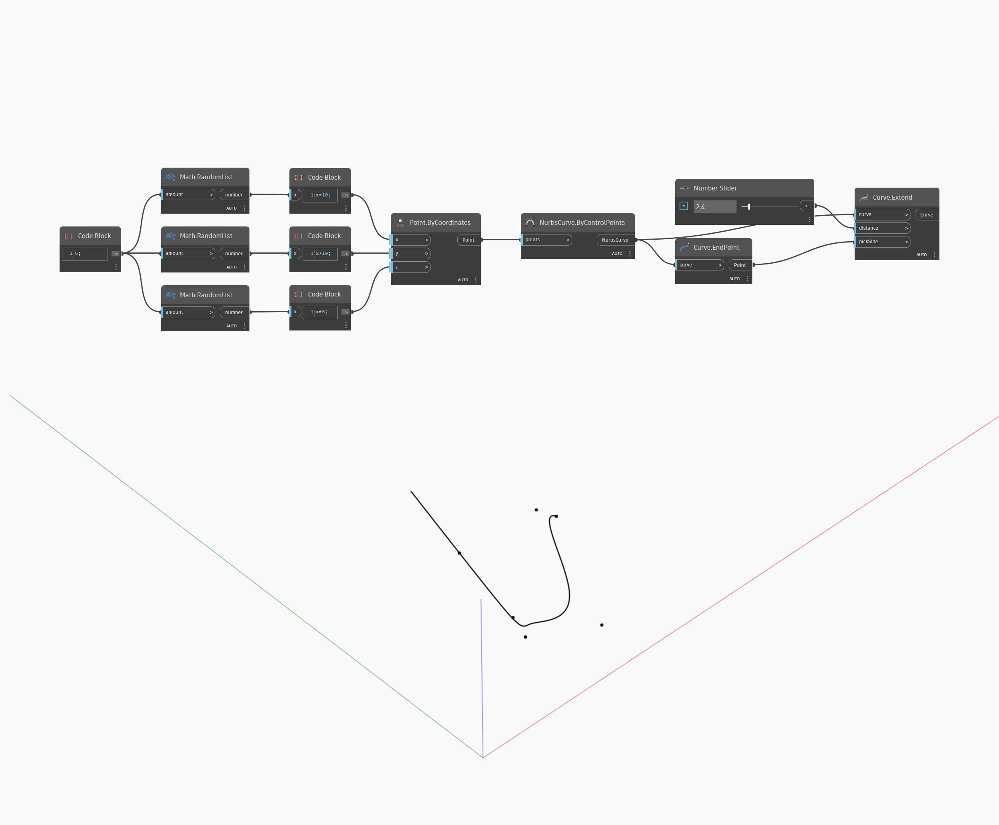

## Em profundidade
Extend estenderá uma curva de entrada por uma determinada distância de entrada. A entrada pickSide usa o ponto inicial ou final da curva como entrada e determina qual extremidade da curva será estendida. No exemplo abaixo, primeiro criamos uma curva Nurbs usando um nó ByControlPoints, com um conjunto de pontos gerados aleatoriamente como entrada. Usamos o nó de consulta Curve.EndPoint para localizar o ponto final da curva, para usar como a entrada `pickSide`. Um controle deslizante de número permite controlar a distância da extensão.
___
## Arquivo de exemplo

