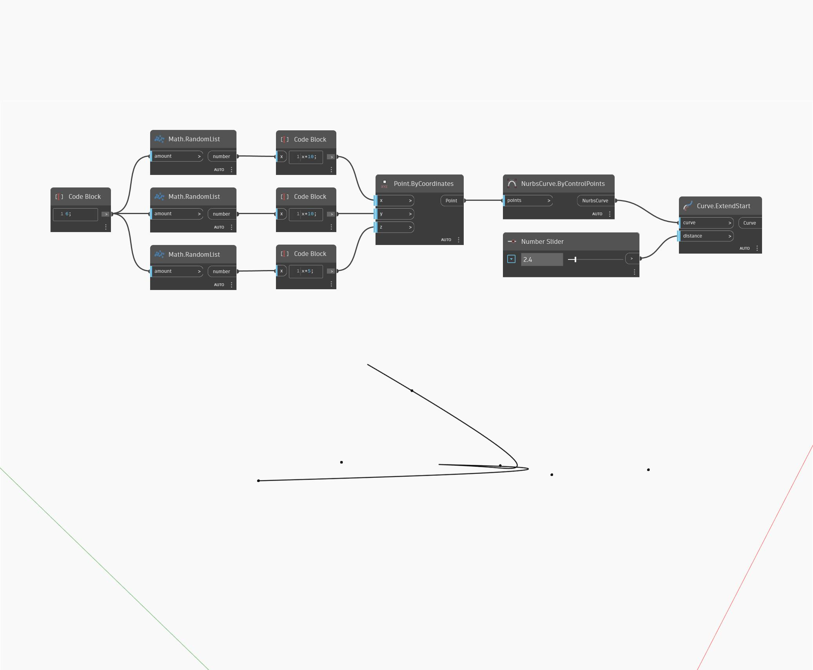

## Em profundidade
Extend Start estenderá uma curva de entrada por uma determinada distância de entrada, começando pelo ponto inicial da curva. No exemplo abaixo, primeiro criaremos uma curva Nurbs usando um nó ByControlPoints, com um conjunto de pontos gerados aleatoriamente como entrada. Um controle deslizante de número permite controlar a distância da extensão.
___
## Arquivo de exemplo

