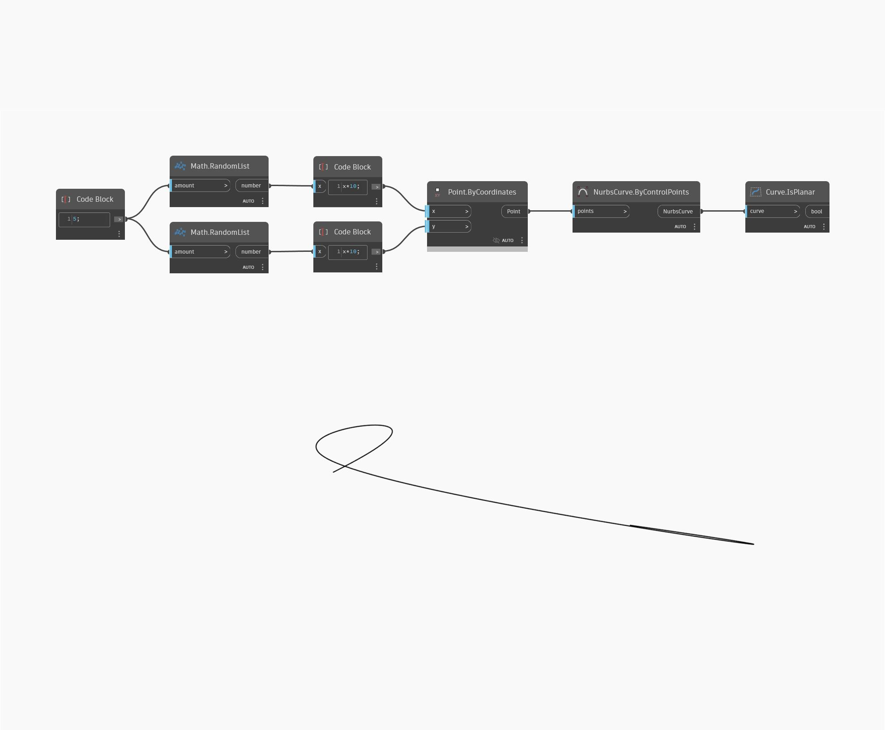

## Em profundidade
Is Planar retornará um valor booleano que corresponde se a curva de entrada é plana ou não. No exemplo abaixo, primeiro criamos uma curva Nurbs usando um nó ByControlPoints, com um conjunto de pontos gerados aleatoriamente como entrada. Em seguida, podemos testar se essa curva é plana usando um nó IsPlanar.
___
## Arquivo de exemplo

