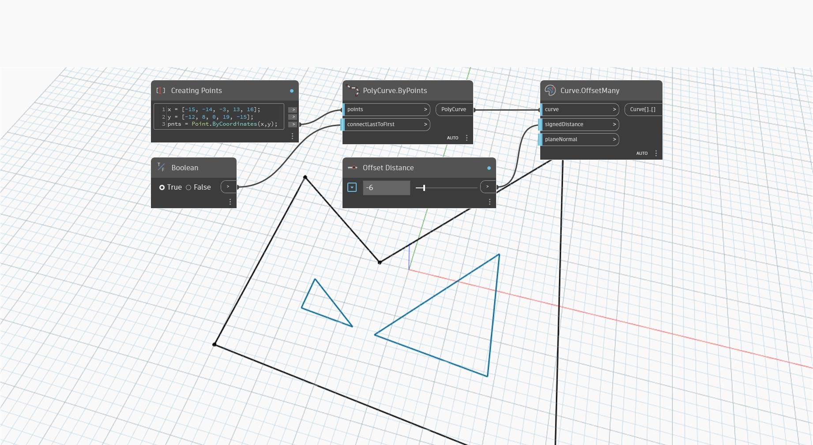

## Em profundidade
`Curve.OffsetMany` cria uma ou mais curvas compensando uma curva planar pela distância fornecida em um plano definido pelo plano normal. Se houver lacunas entre as curvas dos componentes de deslocamento, elas serão preenchidas estendendo as curvas de deslocamento.

A entrada `planeNormal` padroniza para a normal do plano que contém a curva, mas uma normal explícita paralela à normal da curva original pode ser fornecida para controlar melhor a direção do deslocamento.

Por exemplo, se uma direção de deslocamento consistente for necessária para múltiplas curvas que compartilham o mesmo plano, será possível usar a entrada `planeNormal` para substituir normais de curvas individuais e forçar todas as curvas a serem deslocadas na mesma direção. Inverter a normal inverte a direção do deslocamento.

No exemplo abaixo, uma PolyCurve é deslocada por uma distância de deslocamento negativa, que se aplica na direção oposta do produto vetorial entre a tangente da curva e o vetor normal do plano.
___
## Arquivo de exemplo

