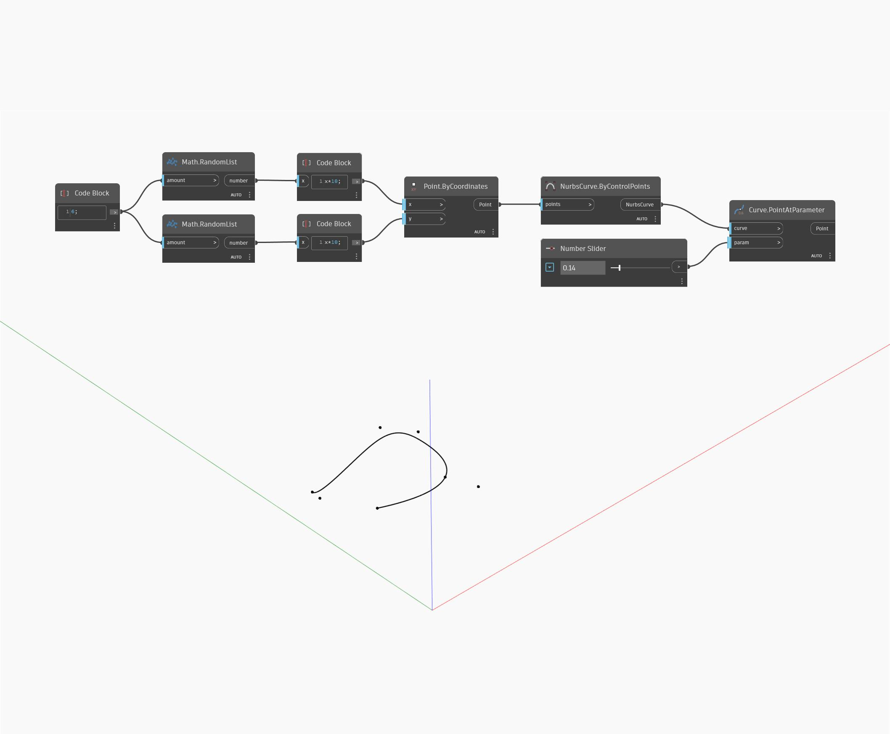

## Em profundidade
Point At Parameter retornará o ponto em uma superfície especificada pelos parâmetros U e V. No exemplo abaixo, primeiro criaremos uma superfície usando um nó BySweep2Rails. Em seguida, usaremos dois controles deslizantes de número para controlar os valores U e V do parâmetro para um nó PointAtParameter.
___
## Arquivo de exemplo

