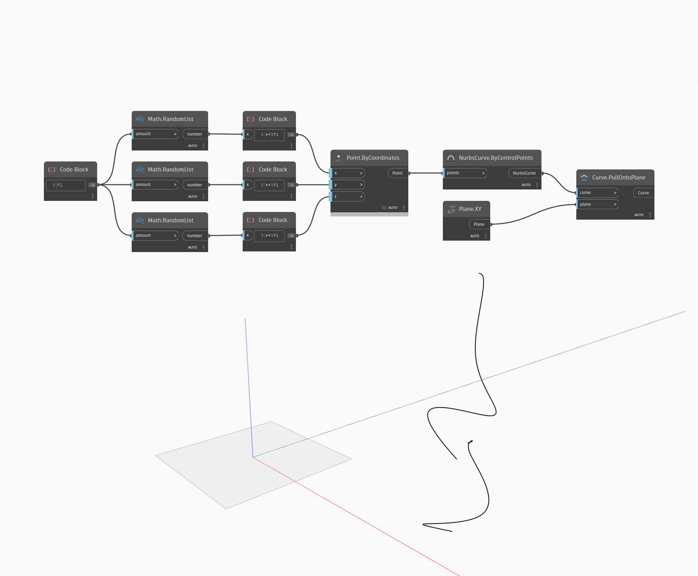

## Em profundidade
Pull Onto Plane criará uma nova curva projetando uma curva de entrada em um plano de entrada, usando a normal do plano como a direção de projeção. No exemplo abaixo, primeiro criaremos uma curva Nurbs usando um nó ByControlPoints, com um conjunto de pontos gerados aleatoriamente como entrada. Usaremos o plano XY universal como o plano para projetar em um nó PullOntoPlane. O resultado é um curva plana no plano XY.
___
## Arquivo de exemplo

