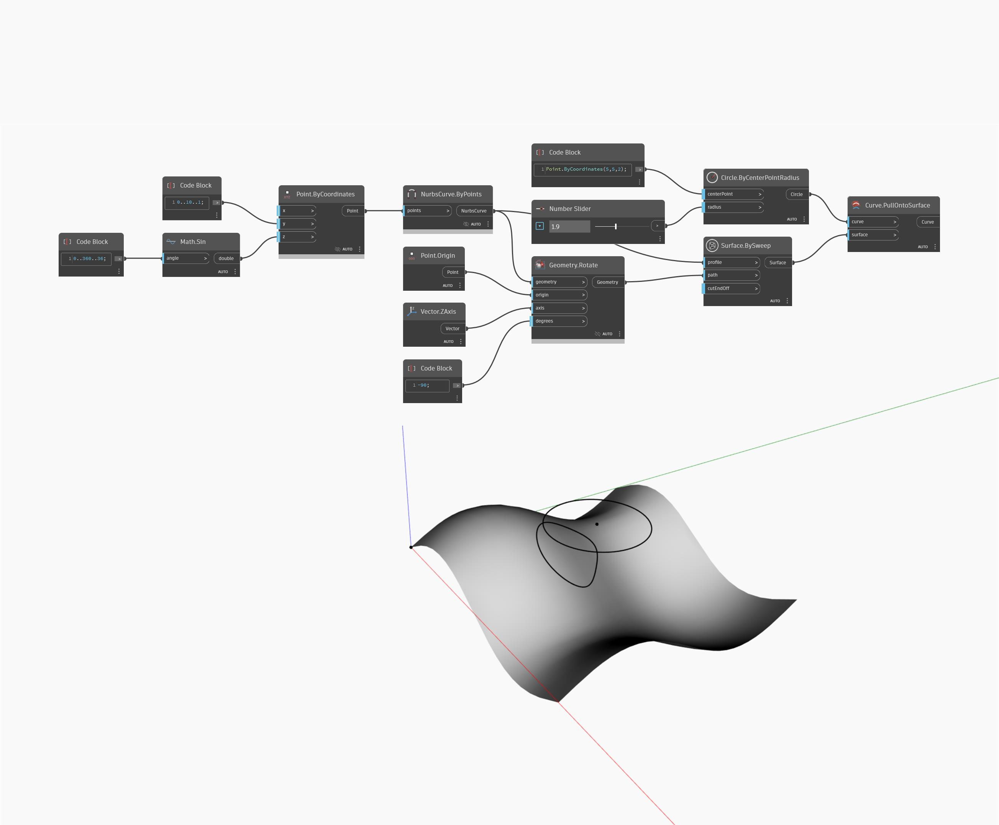

## Em profundidade
Pull Onto Surface criará uma nova curva projetando uma curva de entrada em uma superfície de entrada, usando os vetores normais da superfície como direções de projeção. No exemplo abaixo, primeiro criaremos uma superfície usando um nó Surface.BySweep que usa curvas geradas de acordo com uma curva senoidal. Essa superfície é usada como superfície base para puxar em um nó PullOntoSurface. Para a curva, criamos um círculo usando um bloco de código para especificar as coordenadas do ponto central e um controle deslizante de número para controlar o raio do círculo. O resultado é uma projeção do círculo na superfície.
___
## Arquivo de exemplo

