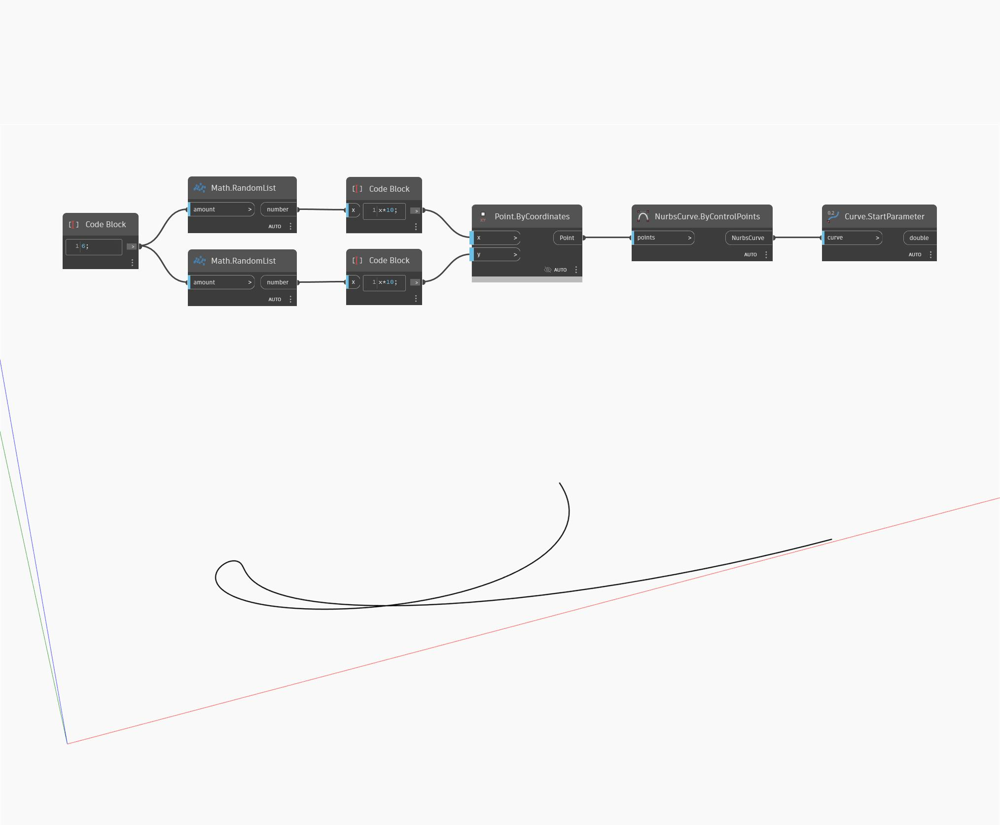

## Em profundidade
Start Parameter retornará um número que representa o início do domínio no qual a curva de entrada pode ser avaliada. Na maioria dos casos, o parâmetro inicial será zero. No exemplo abaixo, primeiro criamos uma curva Nurbs usando um nó ByControlPoints, com um conjunto de pontos gerados aleatoriamente como entrada. Essa curva é, em seguida, usada como entrada para um nó StartParameter.
___
## Arquivo de exemplo

