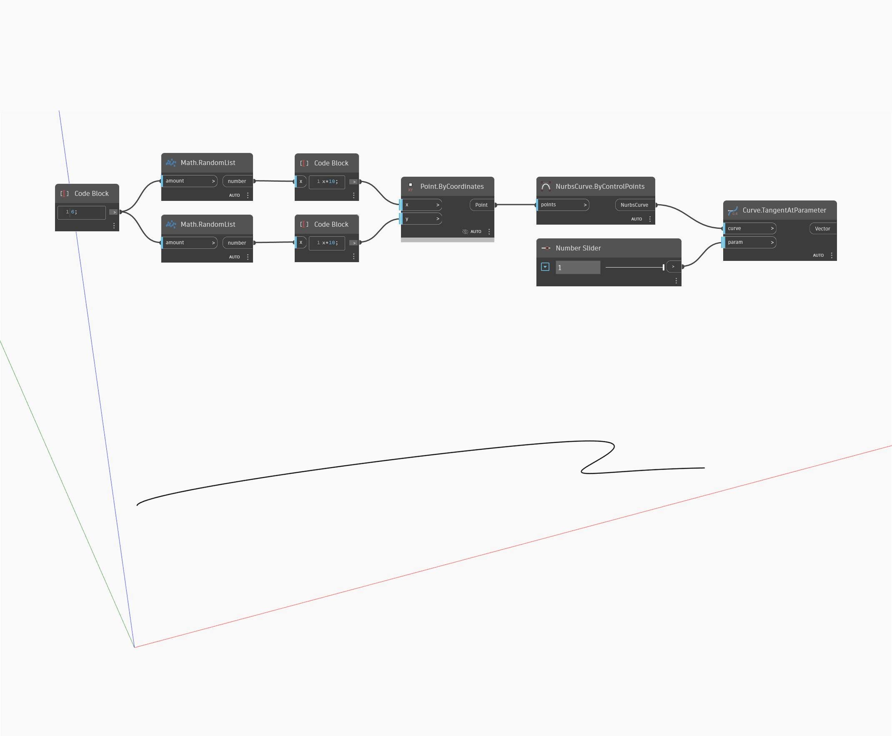

## Em profundidade
Tangent At Parameter retornará um vetor alinhado com a direção da tangente no parâmetro especificado de uma curva. A parametrização de uma curva é medida no intervalo de zero a um, com zero representando o início da curva e um representando o final da curva. No exemplo abaixo, primeiro criamos uma curva Nurbs usando um nó ByControlPoints, com um conjunto de pontos gerados aleatoriamente como entrada. Um controle deslizante de número definido com o intervalo de 0 a 1 é usado para controlar a entrada de parâmetro para um nó TangentAtParameter.
___
## Arquivo de exemplo

