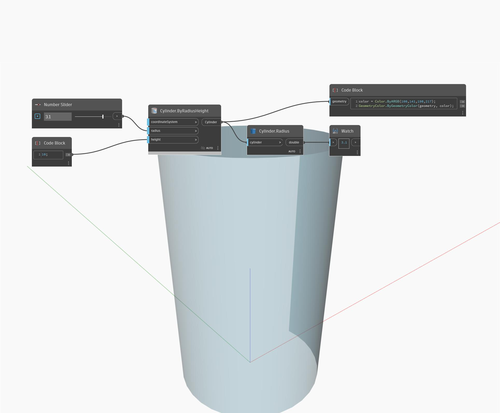

## Em profundidade
`Cylinder.Radius` retorna o raio de um cilindro como um duplo.

No exemplo abaixo, ajustar o controle deslizante numérico alterará o raio do cilindro.

___
## Arquivo de exemplo

