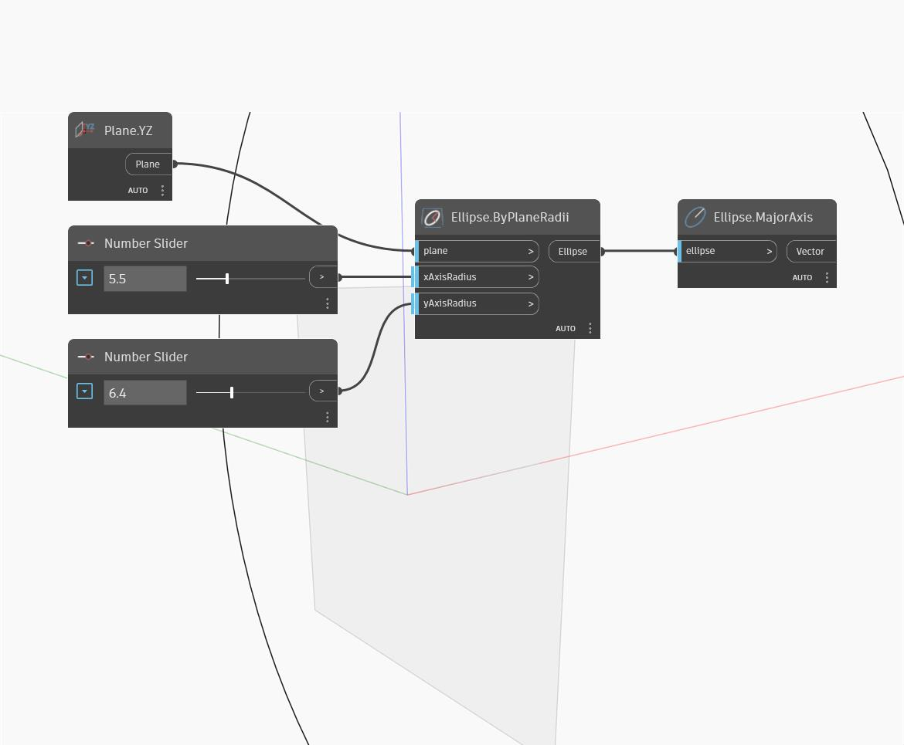

## Em profundidade
Major Axis retornará o maior dos dois eixos da elipse. O eixo tem saída gerada como um vetor, que tem uma magnitude igual ao maior dos dois raios. Note que os eixos Maior e Menor são determinados pelo comprimento, não pela direção. Isto é, o eixo maior pode corresponder a xAxisRadius de uma elipse, mas yAxisRadius de uma elipse diferente. No exemplo, primeiro, criamos um arco de elipse usando o plano XY e uma série de controles deslizantes de número. Em seguida, usamos o eixo maior para extrair o eixo maior da elipse.
___
## Arquivo de exemplo

