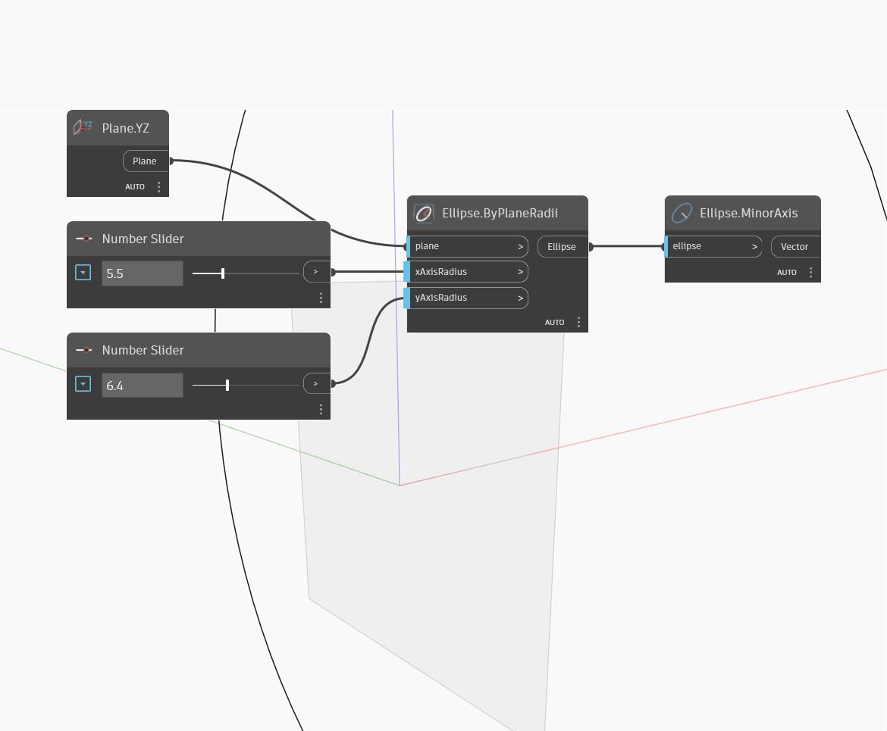

## Em profundidade
Minor Axis retornará o mais curto dos dois eixos da elipse. O eixo tem saída gerada como um vetor, que tem uma magnitude igual ao menor dos dois raios. Observe que os eixos Maior e Menor são determinados pelo comprimento, não pela direção. Isto é, o eixo menor pode corresponder a xAxisRadius de uma elipse, mas yAxisRadius de uma elipse diferente. No exemplo, criamos primeiro um arco de elipse usando o plano XY e uma série de controles deslizantes de número. Em seguida, usamos Minor Axis para extrair o eixo menor da elipse.
___
## Arquivo de exemplo

