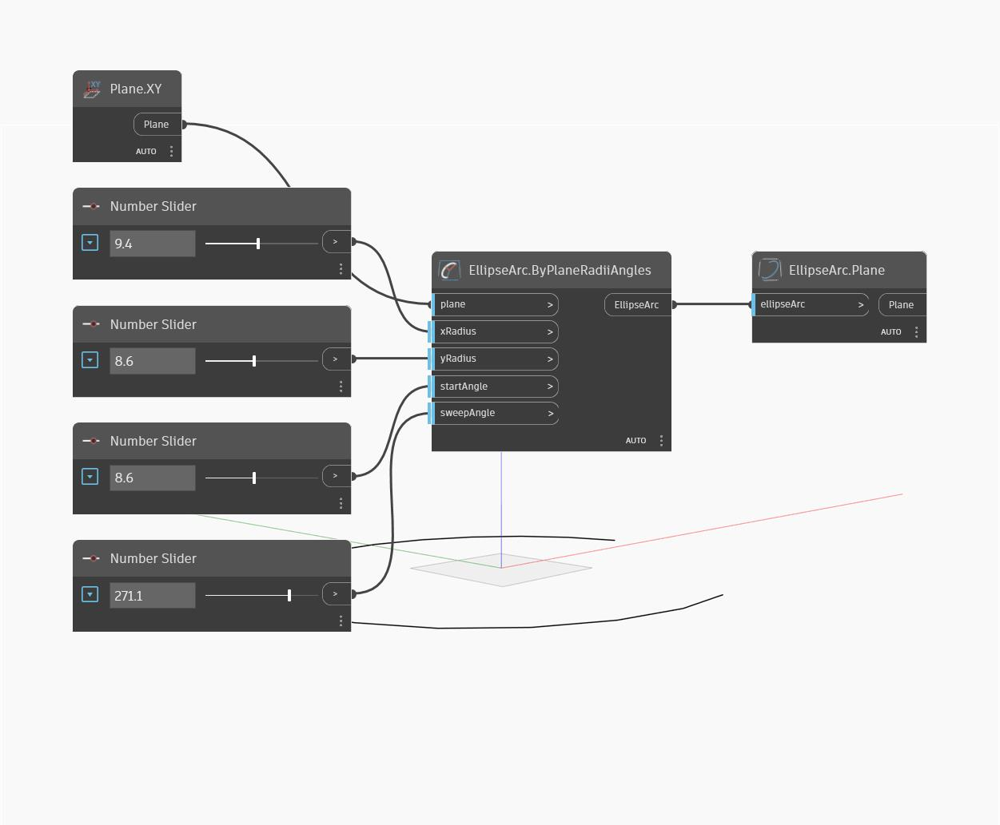

## Em profundidade
`EllipseArc.Plane` encontra o plano de um arco de elipse, que é igual ao plano da elipse completa.

No exemplo abaixo, primeiro criamos um arco de elipse usando o plano XY e uma série de controles deslizantes de números. Em seguida, usamos `EllipseArc.Plane` para extrair o plano da elipse.

___
## Arquivo de exemplo

