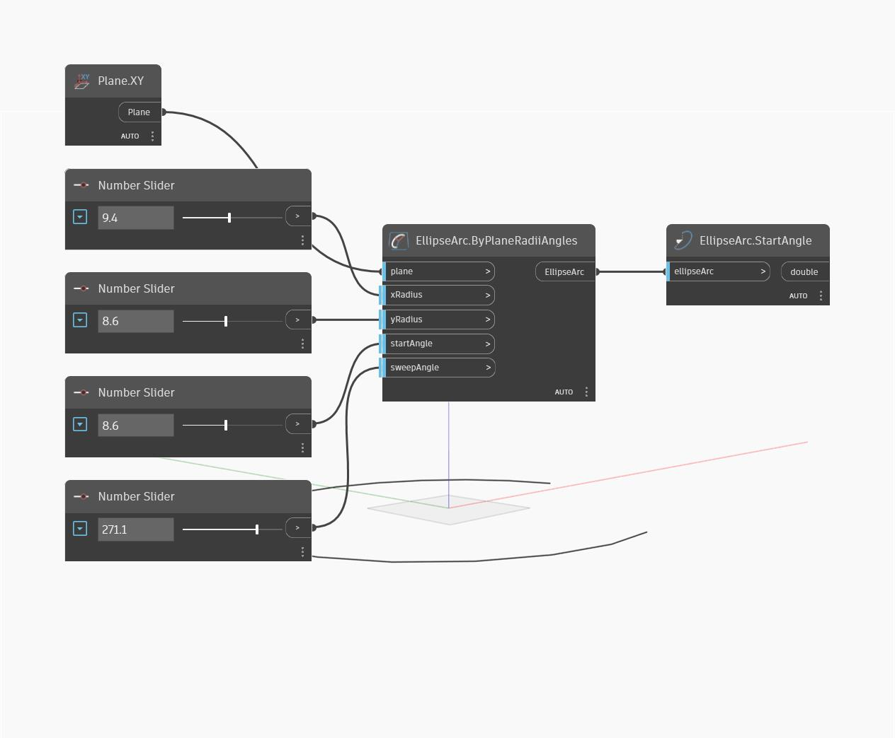

## Em profundidade
Start Angle localiza o ângulo inicial do arco da elipse. Isso é medido em graus no sentido anti-horário desde o eixo X do plano. No exemplo, primeiro criamos um arco da elipse usando o plano XY e uma série de controles deslizantes de número. Em seguida, usamos Start Angle para extrair o ângulo do ponto inicial da elipse.
___
## Arquivo de exemplo

