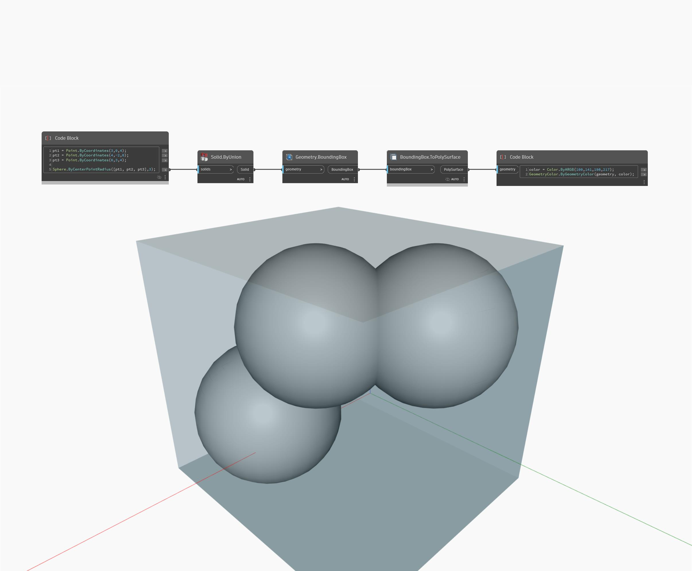

## Em profundidade
`Geometry.BoundingBox` retorna uma caixa definida pela geometria que ela contém. Não é exibida nenhuma BoundingBox, mas pode ser retornada como uma PolySurface usando o nó `BoundingBox.ToPolySurface`.

No exemplo abaixo, é criada uma BoundingBox para um sólido unido e representada como uma PolySurface.

___
## Arquivo de exemplo

