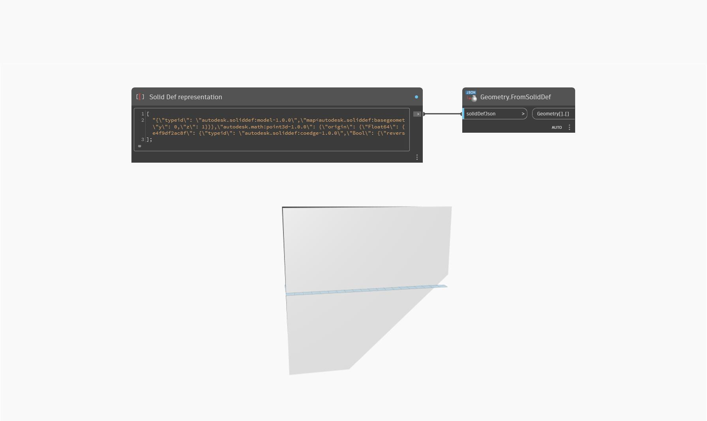

## Em profundidade
`Geometry.FromSolidDef` importa uma de sequência de caracteres JSON Solid Def e retorna uma matriz de geometrias importadas. Ele converte a representação formatada JSON de volta para o formato geométrico. Use `Geometry.ToSolidDef` para converter as geometrias em um formato de sequência de caracteres JSON.

No exemplo abaixo, uma representação Solid Def é convertida em geometria.
___
## Arquivo de exemplo

