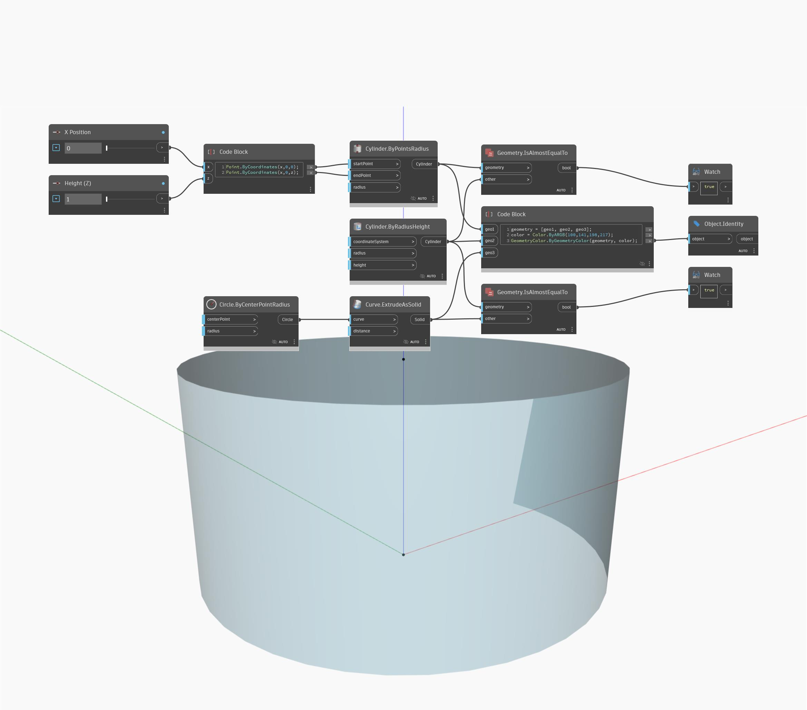

## Em profundidade
`Geometry.IsAlmostEqualTo` retorna um valor booleano que indica se as duas geometrias fornecidas têm as mesmas representações geométricas ou valores numéricos.

No exemplo abaixo, é criado um cilindro de duas maneiras. Em seguida, os dois cilindros são comparados com `Geometry.IsAlmostEqualTo`.
___
## Arquivo de exemplo

