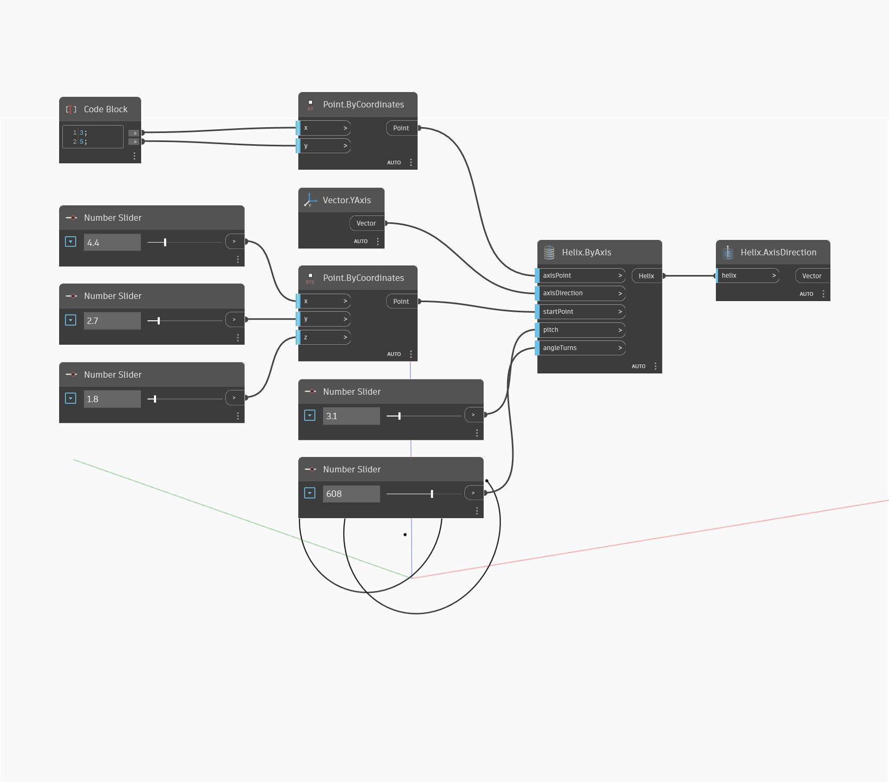

## Em profundidade
Axis Direction retornará a direção do eixo central de uma hélice como um vetor. Juntamente com Axis Point, isso define o eixo central. No exemplo abaixo, criamos uma hélice usando Helix By Axis e, em seguida, usamos a Axis Direction para encontrar a direção do eixo da hélice.
___
## Arquivo de exemplo

