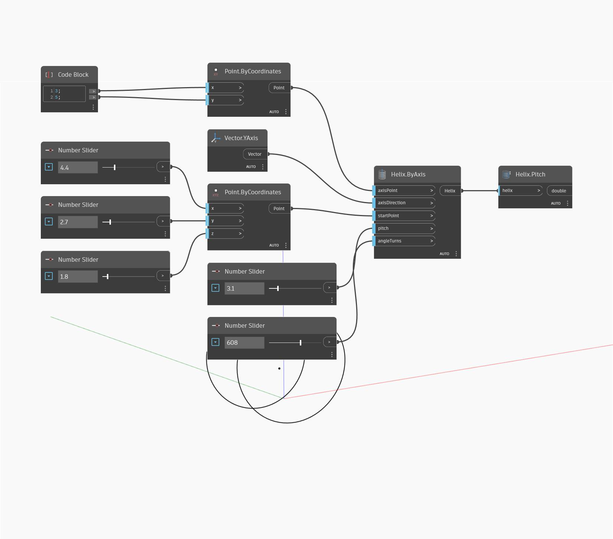

## Em profundidade
Pitch retornará a distância linear ao longo da direção do eixo que uma hélice expande numa volta completa (360 graus). No exemplo abaixo, criamos uma hélice usando Helix by Axis e, em seguida, usamos Pitch para encontrar o passo da hélice.
___
## Arquivo de exemplo

