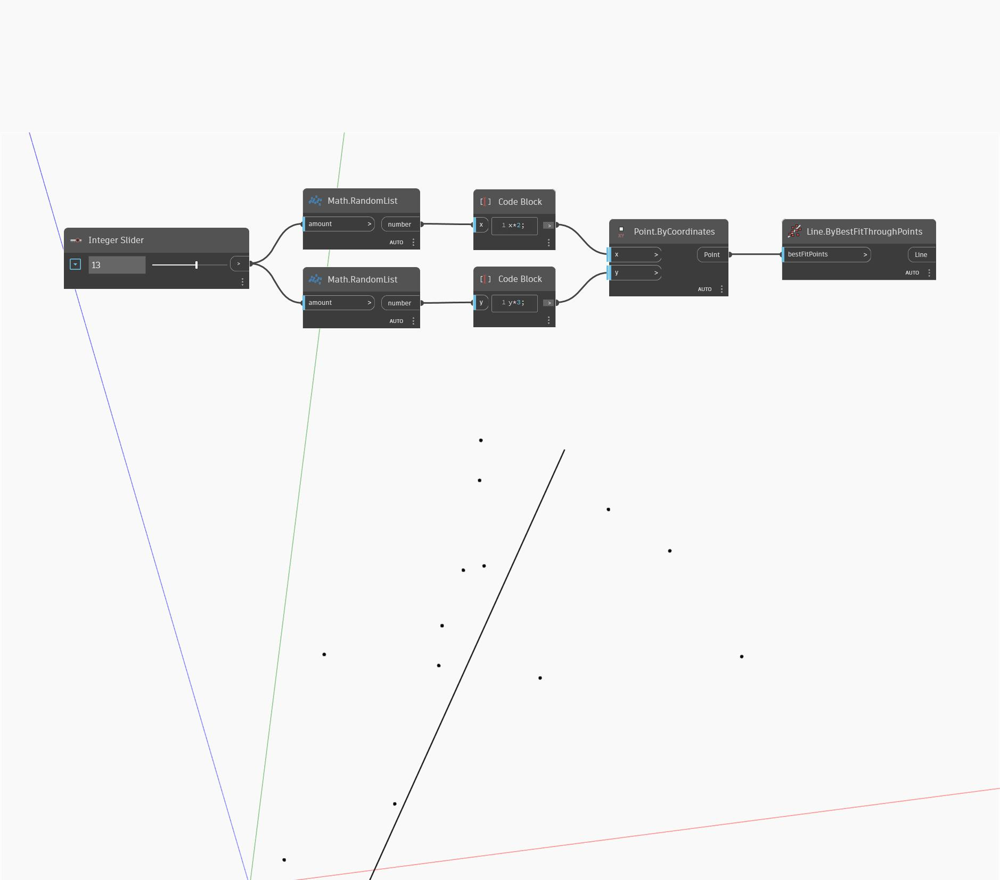

## Em profundidade
`Line.BestFitThroughPoints` cria uma linha aproximando um gráfico de dispersão de pontos. A entrada é uma lista de pontos.

No exemplo abaixo, usamos um controle deslizante numérico para controlar o número de pontos aleatórios gerados e, em seguida, encontramos a linha de melhor ajuste através do conjunto de pontos.

___
## Arquivo de exemplo

