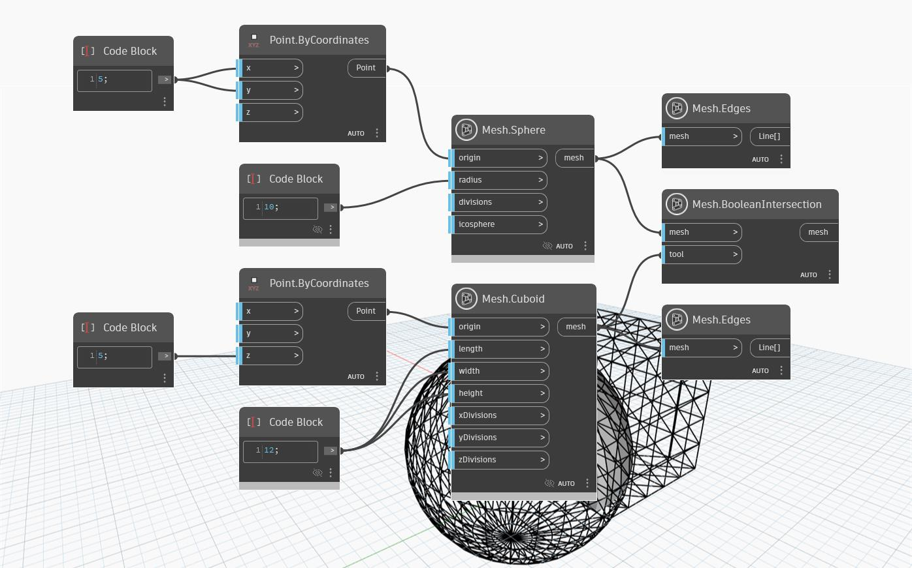

## Em profundidade
A operação 'Mesh.BooleanIntersection' usa uma malha de destino e uma malha de ferramenta como entrada e retorna apenas a parte das duas malhas que faz interseção. No exemplo abaixo, o nó 'Mesh.BooleanIntersection' retorna uma malha resultante na interseção de um cuboide e uma esfera.

(Os nós 'Mesh.Edges' são usados para visualizar as geometrias da malha original e da malha da ferramenta).

## Arquivo de exemplo

