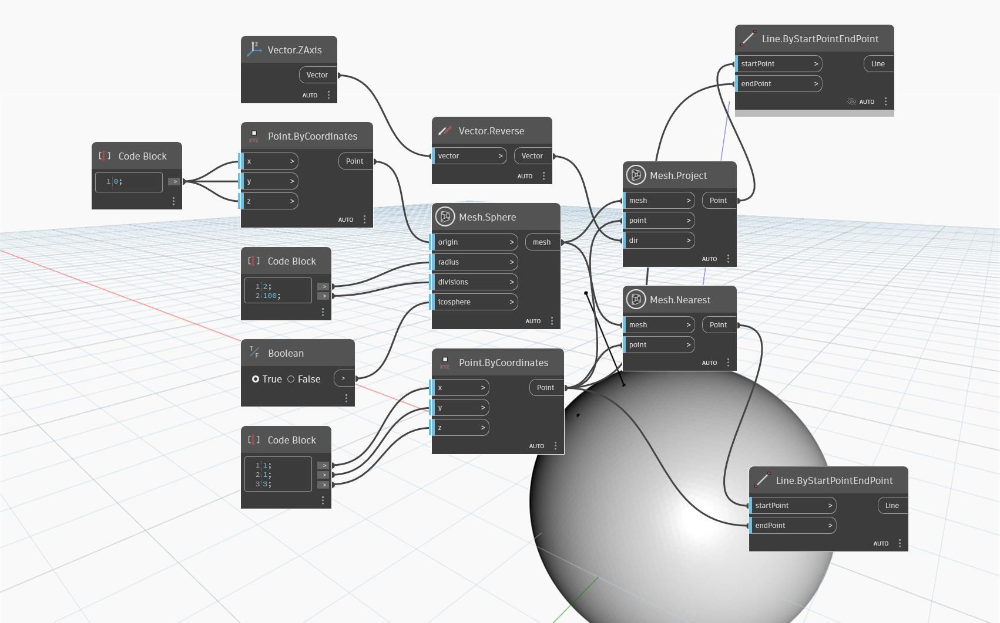

## Em profundidade
'Mesh.Nearest' retorna um ponto na malha de entrada que está mais próximo do ponto especificado. O ponto retornado é uma projeção do ponto de entrada na malha usando o vetor normal para a malha que passa pelo ponto resultando no ponto mais próximo possível.

No exemplo abaixo, um caso de uso simples é criado para mostrar como o nó funciona. O ponto de entrada está acima de uma malha esférica, mas não diretamente na parte superior. O ponto resultante é o ponto mais próximo que se encontra na malha. Isso é contrastado com a saída do nó 'Mesh.Project' (usando o mesmo ponto e malha como entradas junto com um vetor na direção “Z” negativa), em que o ponto resultante é projetado na malha diretamente abaixo do ponto de entrada. 'Line.ByStartAndEndPoint' é usado para mostrar a “trajetória” do ponto projetado na malha.

## Arquivo de exemplo

