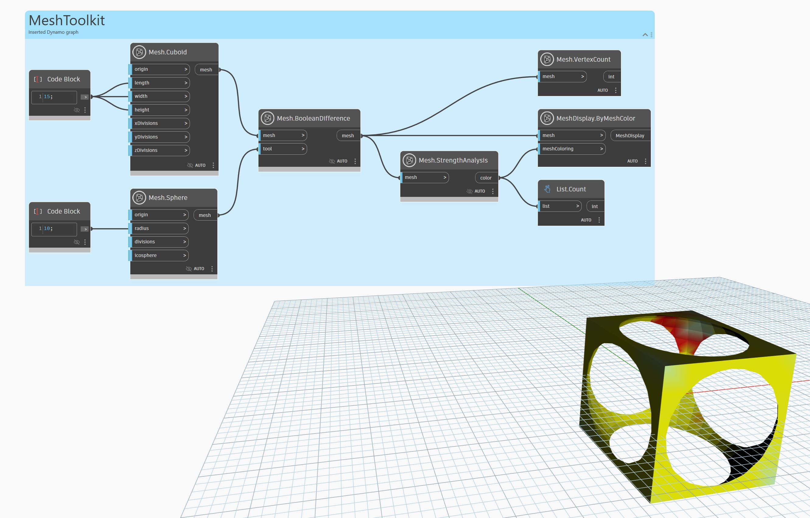

## Em profundidade
 O nó 'Mesh.StrengthAnalysis' retorna uma lista de cores representativas para cada vértice. O resultado pode ser usado junto com o nó 'Mesh.ByMeshColor'. As áreas mais fortes da malha são coloridas de verde, enquanto as áreas mais fracas são indicadas por um mapa de calor de amarelo a vermelho. A análise poderá resultar em falsos positivos se a malha for muito grossa ou irregular (ou seja, se tiver muitos triângulos longos e finos). Você pode tentar usar 'Mesh.Remesh' para gerar uma malha normal antes de chamar 'Mesh.StrengthAnalysis' nela para gerar melhores resultados.

No exemplo abaixo, 'Mesh.StrengthAnalysis' é usado para codificar por cores a resistência estrutural de uma malha na forma de uma grade. O resultado é uma lista de cores que correspondem ao comprimento dos vértices da malha. Essa lista pode ser usada com o nó 'Mesh.ByMeshColor' para colorir a malha.

## Arquivo de exemplo

