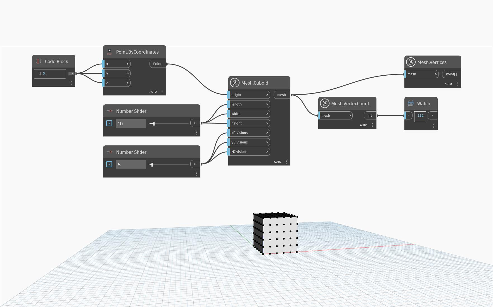

## Em profundidade
Esse nó conta o número de vértices em uma malha fornecida. No exemplo abaixo, 'Mesh.Cuboid' é usado para criar uma malha cuboide, que é usada como entrada para contar os vértices. Além disso, 'Mesh.Vertices' é usado para realçar os vértices do cubo para uma melhor visualização e para exibir a lista de coordenadas por vértice.

## Arquivo de exemplo

