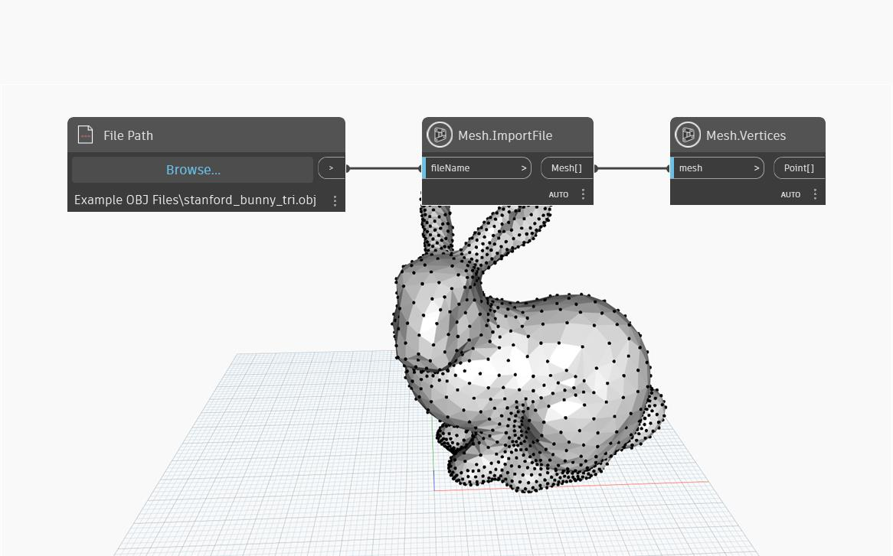

## Em profundidade
'Mesh.Vertices' retorna uma lista de vértices exclusivos de uma malha como uma lista de pontos. A estrutura da lista de saída é compatível com os índices de saída do nó 'Mesh.VertexIndicesByTri' e os dois podem ser usados juntos para reconstruir ou editar a malha.

## Arquivo de exemplo

