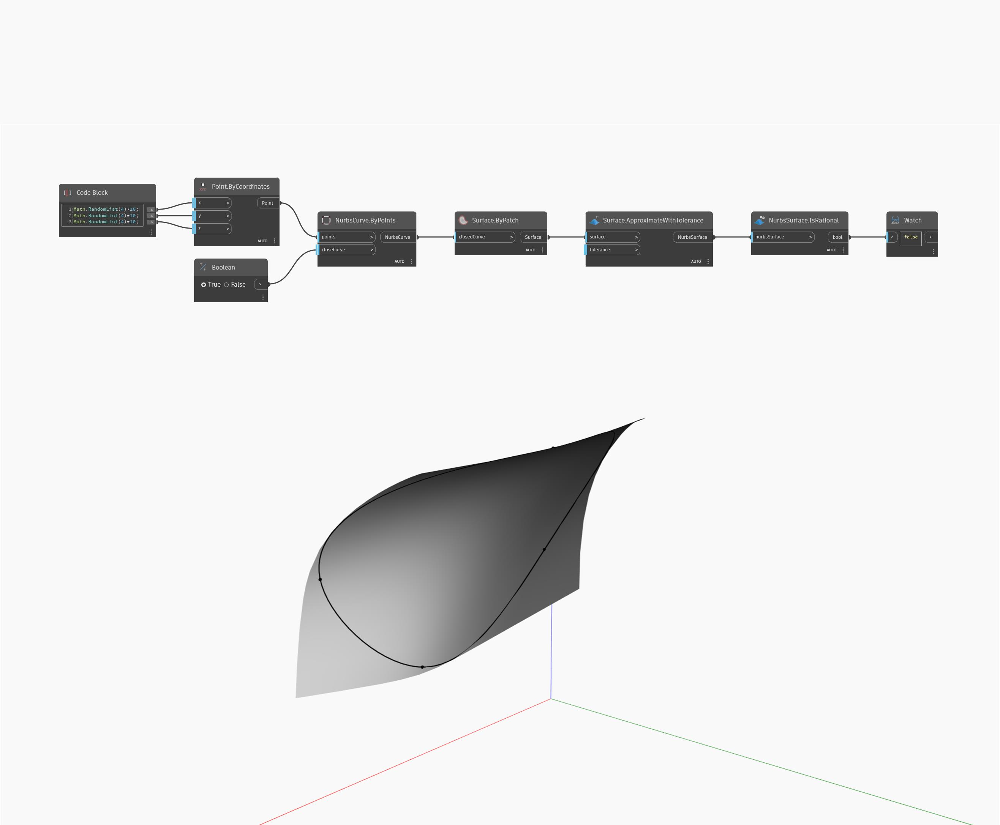

## Em profundidade
IsRational retornará um valor booleano baseado em se uma NurbsSurface é racional. No exemplo abaixo, uma NurbsSurface criada aproximando uma superfície retorna um valor falso.
___
## Arquivo de exemplo

