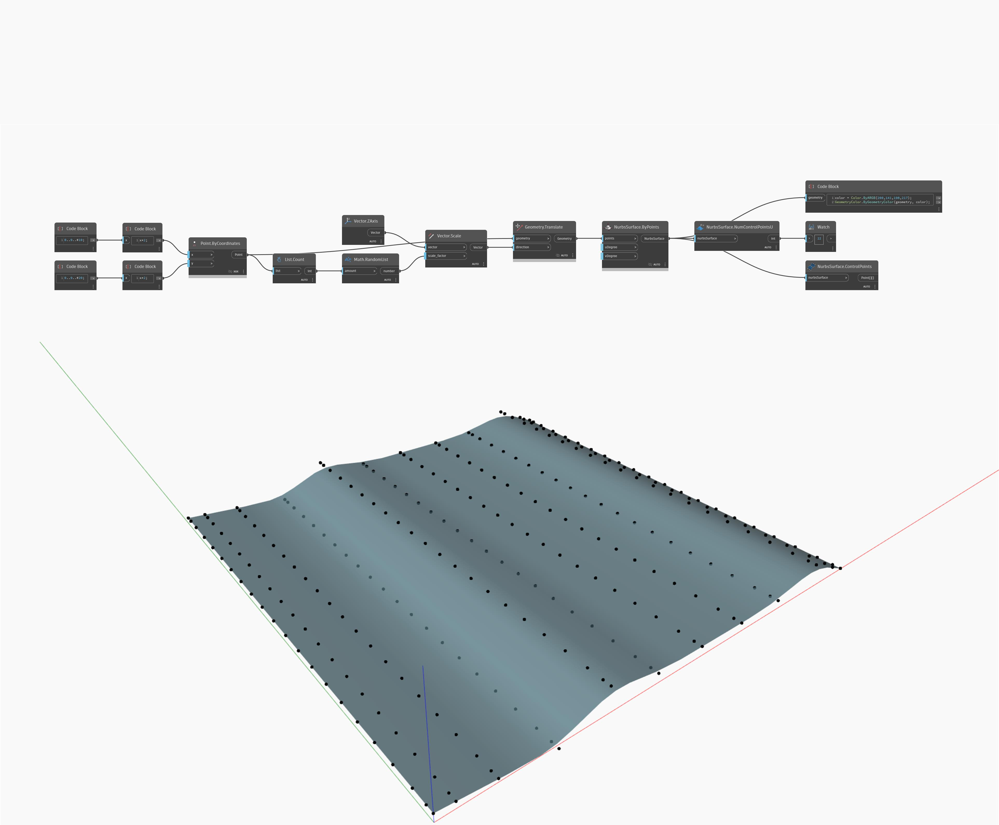

## Em profundidade
NumControlPointsU contará os pontos de controle na direção U de uma NurbsSurface e retornará um número inteiro. No exemplo abaixo, NurbsSurface retornará um número inteiro de 22 para seus pontos de controle U. Os pontos de controle são retornados como pontos usando NurbsSurface.ControlPoints.
___
## Arquivo de exemplo

