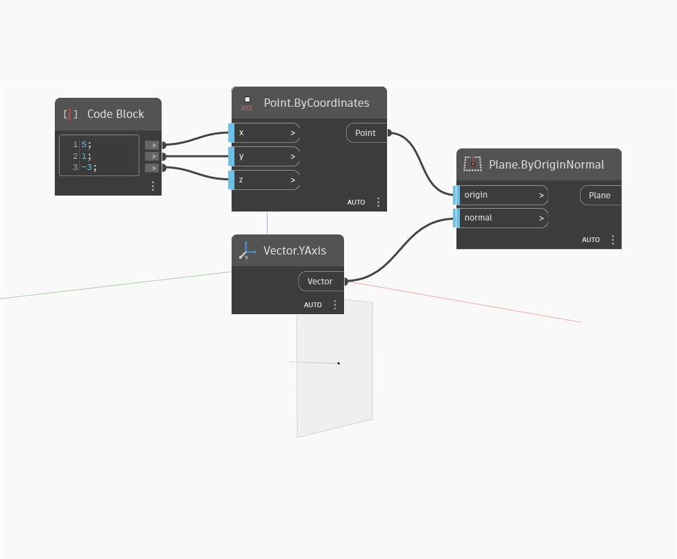

## Em profundidade
Plane by Origin Normal cria um plano usando o ponto de entrada como origem e perpendicular ao vetor normal de entrada. No exemplo abaixo, usamos um bloco de código para especificar as coordenadas x, y e z de um Point By Coordinates. Em seguida, usamos esse ponto como a origem e usamos um eixo Y universal como vetor normal para um Plane by Origin Normal.
___
## Arquivo de exemplo

