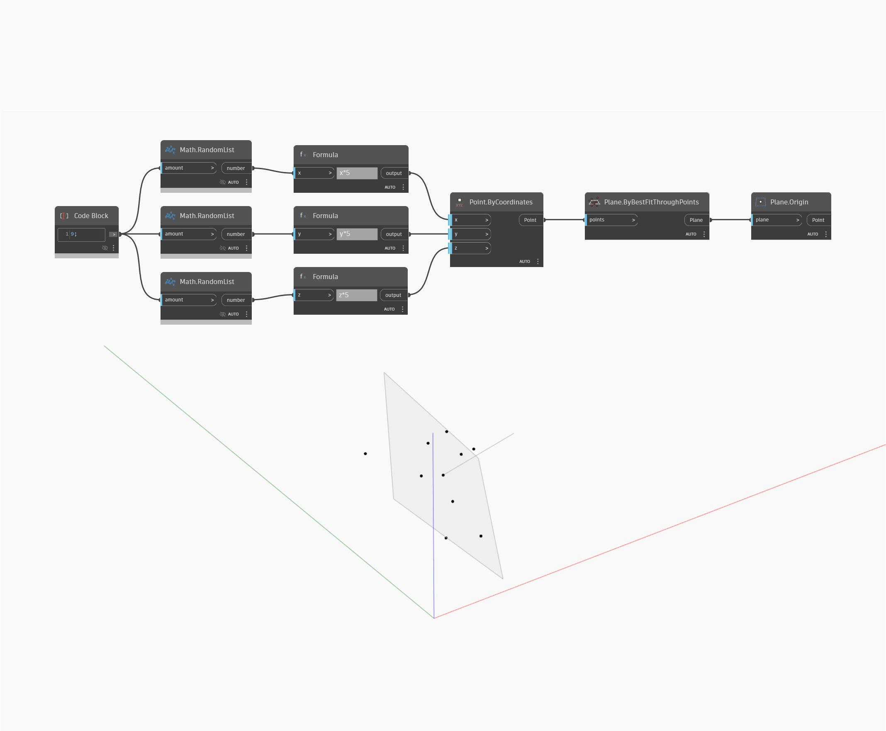

## Em profundidade
Origin retornará um ponto na origem do WorldCoordinateSystem. No exemplo abaixo, um círculo por ponto de centro e raio é criado usando um ponto na origem do WCS.
___
## Arquivo de exemplo

