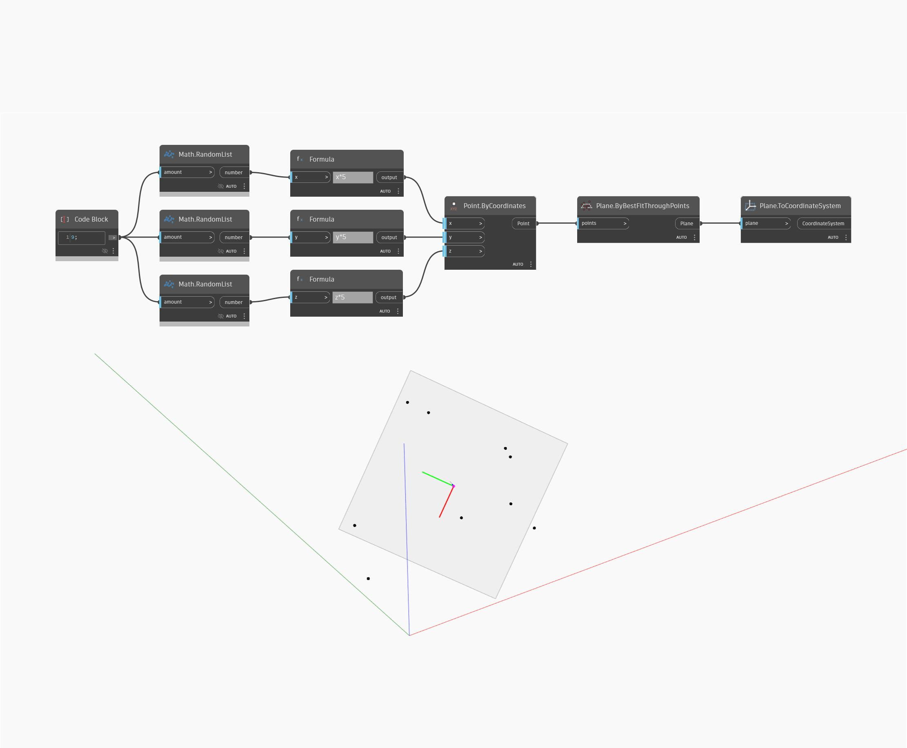

## Em profundidade
Plane To Coordinate System retorna um sistema de coordenadas com base no plano de entrada, usando a origem do plano, XAxis e YAxis. No exemplo abaixo, primeiro usamos um conjunto de pontos aleatórios para criar um Plane by Best Fit Through Points. Em seguida, podemos usar ToCoordinateSystem para converter o plano em um sistema de coordenadas
___
## Arquivo de exemplo

