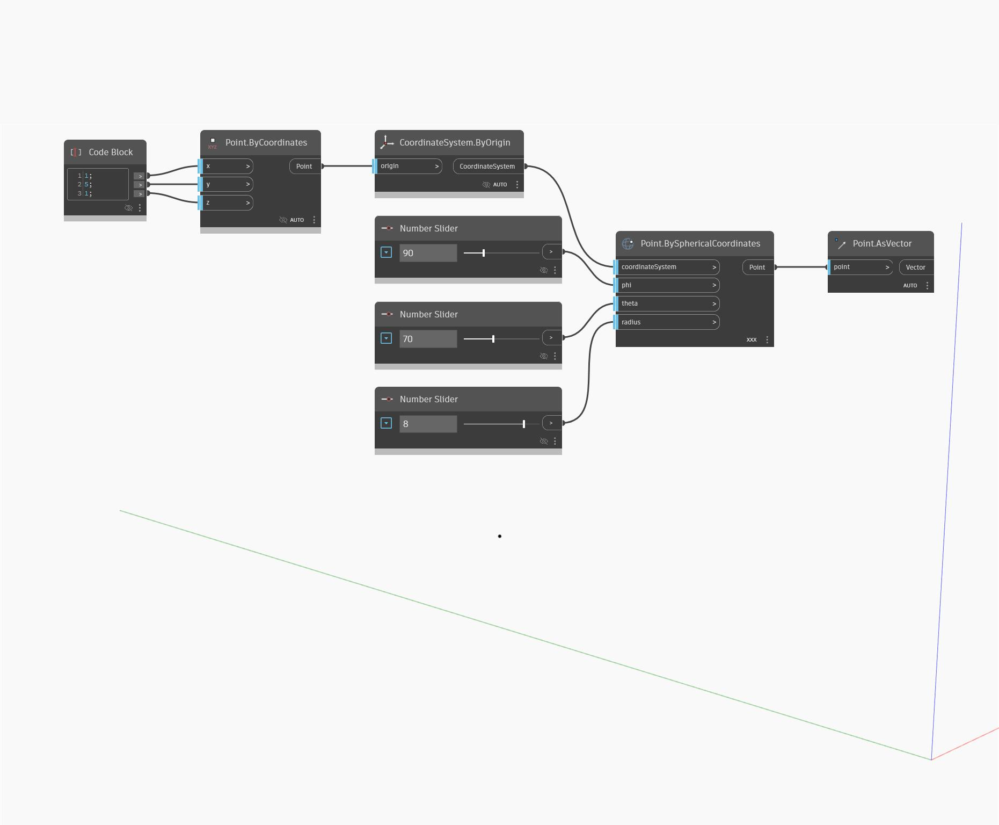

## Em profundidade
Point as Vector usa um ponto de entrada e retorna um vetor com componentes x, y e z iguais às coordenadas cartesianas do ponto. Isso também pode ser considerado como a criação de um vetor por dois pontos, na qual o primeiro ponto é a origem universal e o segundo ponto é o ponto de entrada. No exemplo abaixo, usamos PointBySphericalCoordinates para gerar um ponto e, em seguida, usamos AsVector para obter um vetor que podemos controlar usando coordenadas esféricas.
___
## Arquivo de exemplo

