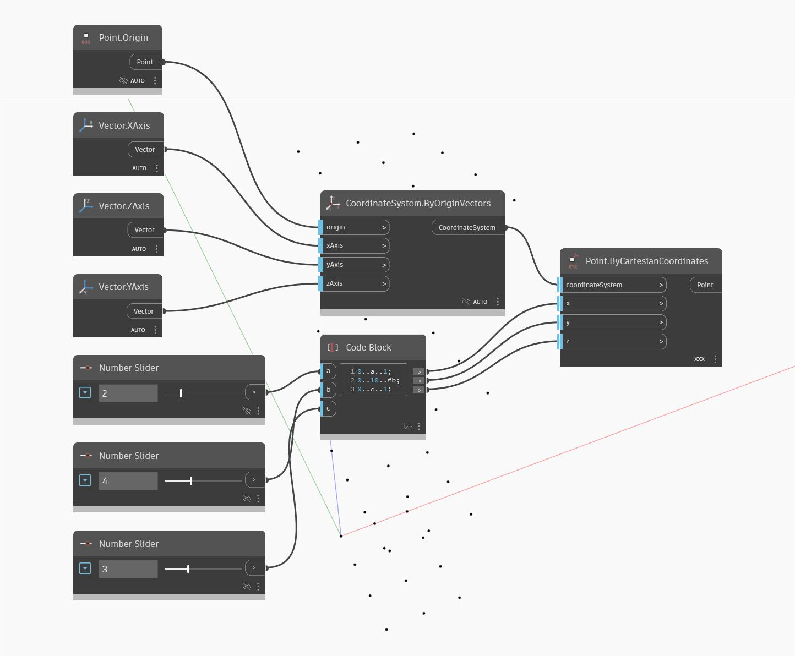

## Em profundidade
Point By Cartesian Coordinates nos oferece a habilidade de definir os valores X, Y e Z de uma localização de ponto. Neste exemplo, estamos definindo vários faixas de bloco de código controladas por controles deslizantes para direcionar a matriz tridimensional de pontos.
___
## Arquivo de exemplo

