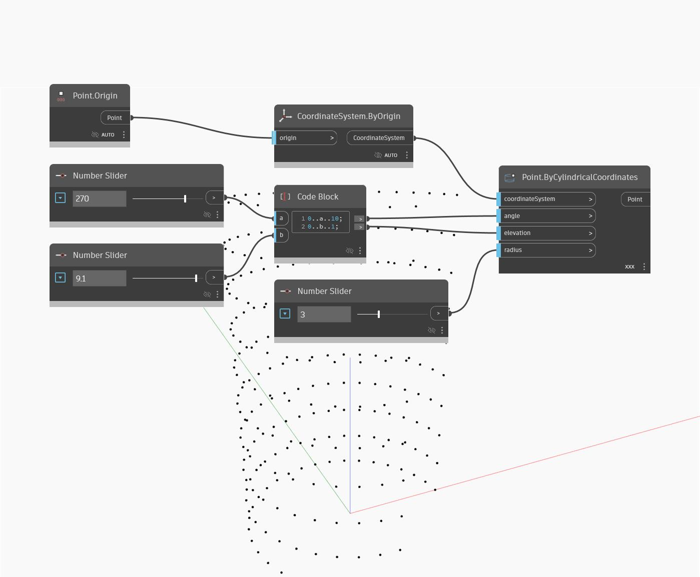

## Em profundidade
O nó Point By Cylindrical Coordinates cria um ponto localizado dentro de um espaço cilíndrico. Aqui, definimos a amarra como referência cruzada e usamos uma faixa de ângulos e elevações para gerar uma grade de pontos ao longo de um cilindro com um raio dinâmico.
___
## Arquivo de exemplo

